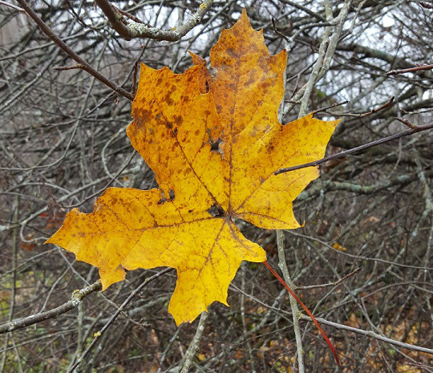
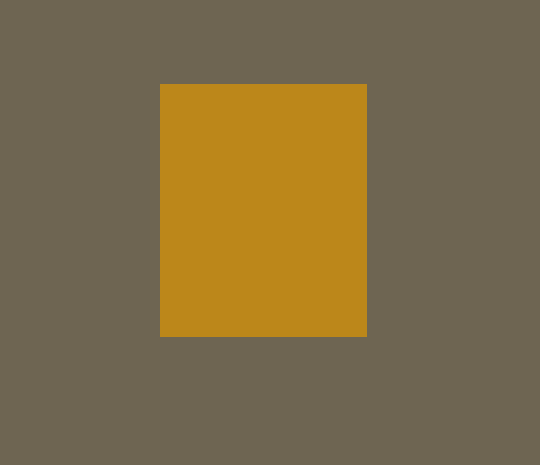

## Image Segmentation

This repository contains an implementation solving the problem of partitioning an image into a monochromatic rectangle -and background such that the sum of squared errors is minimized. For further details, see [this page](http://ppc.cs.aalto.fi/2020/is/hints/). [OpenMP](https://www.openmp.org/) and [Intel Intrinsics](https://software.intel.com/sites/landingpage/IntrinsicsGuide/) are utilized to accelerate computations.

<p align="center">
  
  
  <p align="center">Figure 1: An image along with the corresponding optimal segmentation</p>
</p>

----

### Running Locally

   1. Ensure you have [CMake](https://cmake.org) version ≥ 3.16, and [OpenCV](https://opencv.org) version ≥ 4.4.0
   2. In the project directory, do ```mkdir build ; cd build```
   3. Define an environment variable ```OpenCV_DIR``` pointing to ```path/to/opencv/build``` directory. Alternatively, define it as a CMake cache variable.
   4. To generate project files, do ```cmake ..```
   5. You can use ```cmake --build .``` to build the project while abstracting away any platform-specific build tool usage. Note, however, that certain compilers, such as MSVC, support different build configurations. To achieve best performance, you may need to specify the configuration, for example in the case of MSVC, with ```--config Release```.
   6. Run the executable, passing it the input and output image paths
   
----

### Note

Despite the implementation being highly parallel, the brute-force nature of the algorithm still makes segmenting large images with it infeasible. Further, there are likely aspects in the current implementation that could be improved to achieve even better performance.
